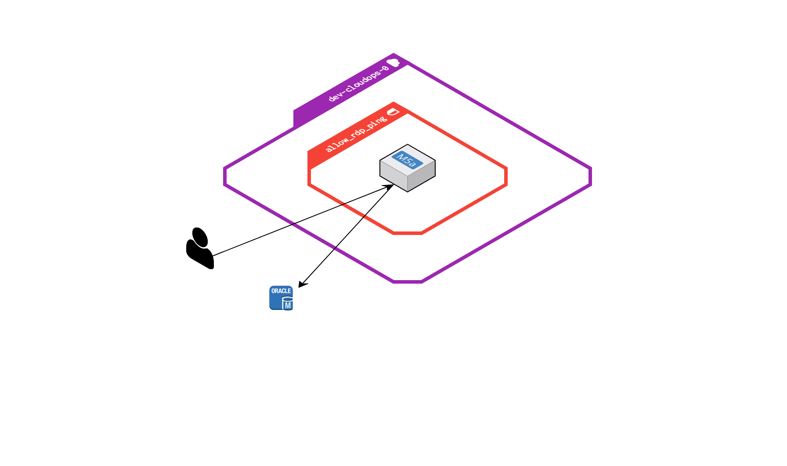

# WQF Module

Creates a new WQF instance

## Inputs

| Name | Description | Type | Default | Required |
|------|-------------|------|-------|-------|
| environment | Environment in which to build | string | None | Yes |
| vpc_id | VPC in wjich to build | string | None | Yes |

## Outputs

| Name | Description |
|------|-------------|
| instance_id | The instance ID |
| instance_ip | The private IP address assigned to the instance |

## Design

